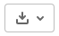

# Instalace

## Přímá instalce z GitLab

V Linuxu je možné instalovat příkazem `install_gitlab` z balíčku `devtools`. Ve Windows se nechová správně. 

```R
devtools::install_gitlab("microclimate_r/microclim", host="git.sorbus.ibot.cas.cz", auth_token="2fmZB-Qg-fbiVvzz2-Lh")
```

Ve Windows lze instalovat následujícím kódem. 

```R
destfile <- tempfile(pattern = "microclim", tmpdir = tempdir(), fileext = ".tar.gz")
download.file("https://git.sorbus.ibot.cas.cz/api/v4/projects/microclimate_r%2Fmicroclim/repository/archive?ref=HEAD&private_token=2fmZB-Qg-fbiVvzz2-Lh", destfile=destfile)
install.packages(destfile, repos=NULL, type="source")
file.remove(destfile)
```

## Lokální instalace

Celý git repozitář je možné klonovat následujícími příkazy. V případě, že se chcete vyhnout příkazové řadce a git,
tak je možné celý obsah komprimovaný jako zip stáhnout přes tlačítko:




```sh
git clone https://git.sorbus.ibot.cas.cz/microclimate_r/microclim.git
```

nebo

```sh
git clone git@git.sorbus.ibot.cas.cz:microclimate_r/microclim.git
```

Instalaci balíčku je možné provést následujícím příkazem
za předpokladu, že pracovní adresář je nastavený na adresář, ve kterém se nachází README.md.

```R

install.packages(".", repos = NULL, type="source")

```

Případně v RStudiu je možné instalovat v menu Build -> Install and restart.

# API
## model

Soubor [R/model.R](R/model.R). Obsahuje definice tříd.

### model.Sensor

Třida pro definici sensorů a jejich parametrů. Dávalo by mi smysl ji mít oddělenou od dat z čidel.

### model.LocalityMetadata

Třída pro uložení informací o lokalitě.

### model.LoggerMetadata

Třída pro uložení informací o loggeru.

### model.SensorData

Třída pro uložení informací o sensoru včetně dat. Data jsou uložena v `data.frame`,
který má dva slouce `date` a `value`.

### model.DataFormat

Třída pro dafinici formátu dat, který lezou z konkrétního loggeru.

### model.TMS3DataFormat

Zděděná třída rozšiřující `model.DataFormat` kvůli detekci formátu data.

## prepare

Soubor [R/prepare.R](R/prepare.R). Obsahuje funkce pro parsování dat z loggerů.

### prepare.read\_files\_by\_csv

Funkce pro načtení dat z více souborů. Funkci se předá csv soubor s tabulkou s popisem souborů.

Je možné otestovat následujícím způsobem:

```R
library(microclim)
localities_data <- microclim::prepare.read_files_by_csv("tests/data/files_table.csv")
```

### prepare.read\_files

### prepare.read\_TMS1\_logger

### prepare.read\_TMS3\_TMS4\_logger

Funkce pro načtení dat z TMS3 a TMS4 loggeru. Volá univerzální funkci `prepare.read_logger`,
který předá instanci třídy `model.TMS3DataFormat`, podle které se načte správně zdrojový soubor.

Je možné otestovat následujícím způsobem:

```R
library(microclim)
logger_data <- microclim::prepare.read_TMS3_TMS4_logger("tests/data/data_94184102_0.csv")
```

### prepare.read\_logger`

Univerzální funkce pro čtení surových dat z loggerů. Jako parametr dostane instanci třídy `model.DataFormat`.

Chtěl jsem, aby S4 objekt obsahoval seznam S4 objektů. pravděpodobně to nejde bez instalace rozšiřujícího balíčku.
Proto jsem zvolil následující výstupní formát:

seznam obsahující dvě položky:
* `metadata` - instance třídy `model.LoggerMetadata`
* `sensors_data` - seznam instancí třídy `model.SensorData`

### prepare.functions\_read\_logger`

## data

Soubory rda z adresáře data. O vytvoření dat se starají R soubory z adresáře data-raw.

### data.source\_data\_formats

Seznam instancí třídy `model.DataFormat`, které definují jednotlivé vstupní formáty.
