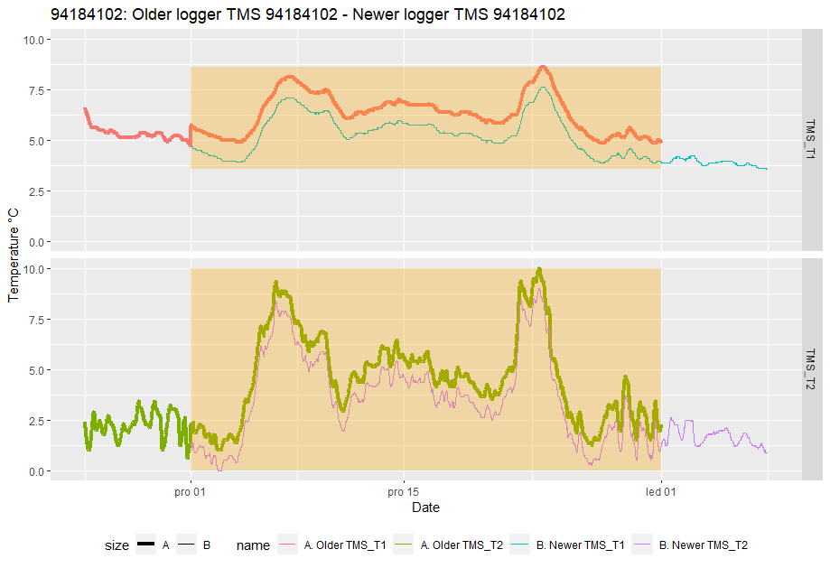
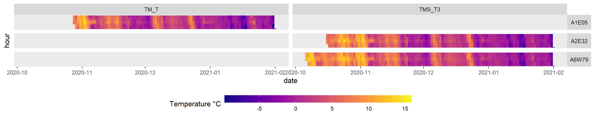
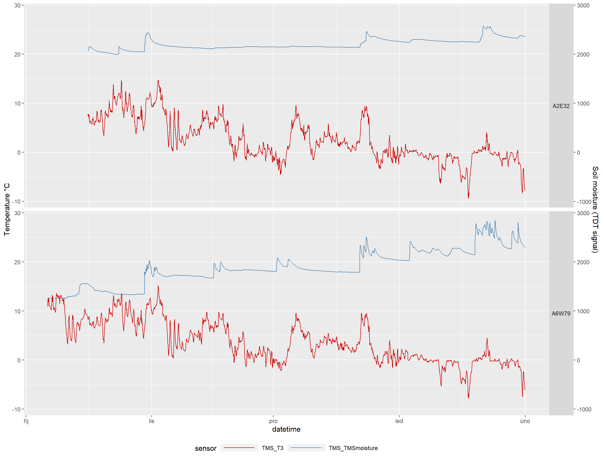

```{r, include = FALSE,purl=FALSE}
knitr::opts_chunk$set(
  collapse = TRUE,
  comment = "#>"
)
```

```{r,eval=FALSE,include=FALSE,comment='',purl=TRUE}

# === First install dependencies ===
requiered_packages <- c("stringr", "lubridate", "tibble", "dplyr", "purrr",
                        "ggplot2", "ggforce", "viridis", "runner", "rmarkdown",
                        "knitr", "kableExtra", "tidyr", "plotly")
missing_packages <- requiered_packages[!(requiered_packages %in% installed.packages()[,"Package"])]
if(length(missing_packages)) install.packages(missing_packages)

# === Install myClim ===
install.packages("http://labgis.ibot.cas.cz/myclim/myClim_latest.tar.gz", repos=NULL, build_vignettes=TRUE)

```

## Reading Microclimatic Data
myClim natively supports the import of several file formats, which can be viewed by running the command `r names(myClim::mc_data_formats)` in R. To specify the data format when reading in files, set the dataformat_name parameter. Alternatively, myClim can read in records from any wide or long data frame in R.

**The mc_read_files(), mc_read_wide(), and mc_read_long()** functions can be used for reading in data without metadata. These functions are user-friendly, fast, and allow for exploratory data analysis. myClim automatically organizes data into artificial localities, and metadata can be updated at a later stage. To organize records into real localities and provide metadata, use the **mc_read_data()** function along with two tables:1. A table that specifies logger file paths, data format name, logger type, and locality. 2. A table that provides locality metadata, such as coordinates, elevation, time offset to UTC, and so on.

```{r eval=TRUE,warning=FALSE}
library(myClim)
## Read without metadata
# read from Tomst files
tms.f <- mc_read_files(c("data_91184101_0.csv", "data_94184102_0.csv",
                         "data_94184103_0.csv"),
                       dataformat_name = "TOMST", silent = T)

# read from HOBO files
hob.f <- mc_read_files(c("20024354_comma.csv"), 
                       dataformat_name = "HOBO",
                       date_format = "%y.%m.%d %H:%M:%S",
                       silent = T)

# read all Tomst files from current directory
tms.d <- mc_read_files(".", dataformat_name = "TOMST", recursive = F, silent = T)

# read from data.frame
meteo.table <- readRDS("airTmax_meteo.rds") # wide format data frame 
meteo <- mc_read_wide(meteo.table, sensor_id = "T_C", 
                      sensor_name = "airTmax", silent = T)

## Read with metadata
# provide two tables. Can be csv files or R data.frame
ft <- read.table("files_table.csv", sep=",", header = T)
lt <- read.table("localities_table.csv", sep=",", header = T)

tms.m <- mc_read_data(files_table = "files_table.csv",
                      localities_table = lt,
                      silent = T)

```


## Pre-Processing

* **Cleaning Time Series:** `mc_prep_clean()` corrects time-series data if it is in the wrong order, contains duplicates, or has missing values. The cleaning log is saved in the myClim object and can be accessed using `mc_info_clean()` after cleaning. By default, cleaning is performed during reading. 

```{r eval=TRUE}
# clean runs automatically while reading
tms <- mc_prep_clean(tms.m, silent = T) # clean series
tms.info <- mc_info_clean(tms) # call cleaning log
```


* **Handling time zones:** myClim expects input data to be in UTC time. However, it is ecologically meaningful to use solar time instead, as it respects local photoperiods, especially when working with global datasets. The `mc_prep_solar_tz()` function calculates solar time from the longitude of the locality. Besides solar_tz the offset can be also set manually using `mc_prep_meta_locality()` to respect e.g. political time.

```{r eval=TRUE}
tms <- mc_prep_solar_tz(tms) # calculate solar time

# provide user defined offset to UTC in minutes 
# for conversion to political time use offset in minutes. 
tms.usertz <- mc_prep_meta_locality(tms,
                                    values = as.list(c(A1E05 = 60,
                                                       A2E32 = 0,
                                                       A6W79 = 120)),
                                    param_name = "tz_offset")
```


* **Sensor calibration:**  If your sensor is recording values that are warmer or colder than the true values, and you know the amount of the discrepancy, you can correct the measurements by adding the offsets (+/-). Use `mc_prep_calib_load()` to upload the offsets into the myClim object, and then use `mc_prep_calib()` to apply the offset correction.

```{r eval=TRUE}
# simulate calibration data (sensor shift/offset to add)
i <- mc_info(tms)
calib_table <- data.frame(serial_number = i$serial_number,
                          sensor_id     = i$sensor_id,
                          datetime      = as.POSIXct("2016-11-29",tz="UTC"),
                          cor_factor    = 0.398,
                          cor_slope     = 0)

## load calibration to myClim metadata 
tms.load <- mc_prep_calib_load(tms, calib_table)

## run calibration for selected sensors
tms <- mc_prep_calib(tms.load, sensors = c("TM_T",
                                           "TMS_T1",
                                           "TMS_T2",
                                           "TMS_T3"))
```


* **Info functions:** For data overview use:

  * `mc_info_count()` which returns the number of localities, loggers and sensors in myClim object
  * `mc_info()` returning data frame with summary per sensor
  * `mc_info_meta()` returning the data frame with locality metadata
  * `mc_info_clean()` returning the data frame with cleaning log

```{r, eval=FALSE,error=FALSE,warning=FALSE}
mc_info_count(tms)
mc_info_clean(tms)
mc_info(tms)
```

Example output table of `mc_info()`

```{r, results = "asis",echo=FALSE,error=FALSE,warning=FALSE,purl=FALSE}
library(kableExtra)
kable(head(mc_info(tms), 10), "html", digits = 2) %>%
  kable_styling(font_size = 9)
```


* **Cropping, filtering, and merging:** 

```{r eval=TRUE}

## crop the time-series
start <- as.POSIXct("2021-01-01", tz = "UTC")
end   <- as.POSIXct("2021-03-31", tz = "UTC")

tms   <- mc_prep_crop(tms, start, end)


## simulate another myClim object and rename some localities and sensors
tms1 <- tms
tms1 <- mc_prep_meta_locality(tms1, list(A1E05 = "ABC05", A2E32 = "CDE32"), 
                              param_name = "locality_id") # locality ID

tms1 <- mc_prep_meta_sensor(tms1,
                            values=list(TMS_T1 = "TMS_Tsoil",
                                        TMS_T2 = "TMS_Tair2cm"),
                            localities = "A6W79", param_name = "name") # sensor names

## merge two myClim objects Prep-format
tms.m  <- mc_prep_merge(list(tms, tms1))
tms.im <- mc_info(tms.m) # see info 

## Filtering 
tms.out  <- mc_filter(tms, localities = "A1E05", reverse = T) # exclude one locality.
tms.m    <- mc_filter(tms.m, sensors = c("TMS_T2", "TMS_T3"), reverse = F) # keep only two sensor
tms.if   <- mc_info(tms.m) # see info 
```


* **Updating metadata:** To update locality metadata, use `mc_prep_meta_locality()`. With this function, users can rename the locality, set the time offset, adjust the coordinates, elevation, and other metadata. For updating sensor metadata, use `mc_prep_meta_sensor()`, which allows users to rename the sensor and update the sensor's height or depth. Many sensors have a predefined height, which is important for data joining. 

```{r eval=TRUE}
## upload metadata from data frame

# load data frame with metadata (coordinates)
metadata <- readRDS("metadata.rds")

# upload metadata from data.frame
tms.f <- mc_prep_meta_locality(tms.f, values = metadata)

## upload metadata from named list
tms.usertz <- mc_prep_meta_locality(tms, 
                                    values = as.list(c(A1E05 = 57,
                                                            A2E32 = 62,
                                                            A6W79 = 55)),
                                    param_name = "tz_offset")

```

Metadata table ready for `mc_prep_meta_locality()`

```{r, results = "asis",echo=FALSE,error=FALSE,warning=FALSE,purl=FALSE}
library(kableExtra)
kable(metadata, "html", digits=2) %>%
  kable_styling(font_size = 9)
```

* **Joining in time** To join fragmented time-series that are stored in separate files from separate downloading visits of the localities, use`mc_join()`. 

```{r,eval=FALSE,comment = ''}

# one locality with two downloads in time 
data <- mc_load("join_example.rds")

joined_data <- mc_join(data, comp_sensors = c("TMS_T1", "TMS_T2"))

#> Locality: 94184102
#> Problematic interval: 2020-12-01 00:00:00 UTC--2020-12-31 23:45:00 UTC
#> 
#> Older logger TMS 94184102
#> start                 end
#> 2020-10-06 09:15:00   2020-12-31 23:45:00
#> 
#> Newer logger TMS 94184102
#> start                end 
#> 2020-12-01 00:00:00  2021-04-07 11:45:00 
#>
#> Loggers are different. They cannot be joined automatically.
#> 
#> 1: use older logger
#> 2: use newer logger
#> 3: use always older logger
#> 4: use always newer logger
#> 5: exit
#> 
#> Write choice number or start datetime of use newer 
#> logger in format YYYY-MM-DD hh:mm.
```



## Plotting
You can create a raster plot using `mc_plot_raster()` or a line time series plot using `mc_plot_line()`. The line time series plot supports a maximum of two different physical units (e.g., temperature and soil moisture) that can be plotted together on the primary and secondary y-axes. The plotting functions return a ggplot object that can be further adjusted with ggplot syntax or can be saved directly as PDF or PNG files on your drive.

```{r,eval=FALSE,comment = ''}
## lines
tms.plot <- mc_filter(tms, localities = "A6W79")

p <- mc_plot_line(tms.plot, sensors = c("TMS_T3", "TMS_T1", "TMS_TMSmoisture"))
p <- p+ggplot2::scale_x_datetime(date_breaks = "1 week", date_labels = "%W")
p <- p+ggplot2::xlab("week")
p <- p+ggplot2::aes(size = sensor_name)
p <- p+ggplot2::scale_size_manual(values = c(1, 1 ,2))
p <- p+ggplot2::guides(size = "none")
p <- p+ggplot2::scale_color_manual(values = c("hotpink", "pink", "darkblue"), name = NULL)

## raster
mc_plot_raster(tms, sensors = c("TMS_T3"))

```




## Aggregation
Using the `mc_agg()` function, you can aggregate time-series data (e.g., from 15-minute intervals) into hourly, daily, weekly, monthly, seasonal, or yearly intervals using various functions such as mean, max, percentile, sum, and more.

```{r,eval=TRUE,warning=F}
# with defaults only convert Raw-format  to Agg-format
tms.ag <- mc_agg(tms.m,fun = NULL, period = NULL)

# aggregate to daily mean, range, coverage, and 95 percentile. 
tms.day <- mc_agg(tms, fun = c("mean", "range", "coverage", "percentile"),
                percentiles = 95, period = "day", min_coverage = 0.95)

# aggregate all time-series, return one value per sensor.
tms.all <- mc_agg(tms, fun = c("mean", "range", "coverage", "percentile"),
                percentiles = 95, period = "all", min_coverage = 0.95)

# aggregate with your custom function. (how many records are below -5°C per month)
tms.all.custom <- mc_agg(tms.out, fun = list(TMS_T3 = "below5"), period = "month",
                         custom_functions = list(below5 = function(x){length(x[x<(-5)])}))
r <- mc_reshape_long(tms.all.custom)
```

## Calculation
Within myClim object it is possible to calculate new virtual sensors (i.e., microclimatic variables), such as volumetric water content, growing and freezing degree days, and snow cover duration, among others.
```{r,eval=TRUE,warning=F}
## calculate virtual sensor VWC from raw TMS moisture signal
tms.calc <- mc_calc_vwc(tms.out, soiltype = "loamy sand A")

## virtual sensor with growing and freezing degree days
tms.calc <- mc_calc_gdd(tms.calc, sensor = "TMS_T3",)
tms.calc <- mc_calc_fdd(tms.calc, sensor = "TMS_T3")

## virtual sensor to estimate snow presence from 2 cm air temperature 
tms.calc <- mc_calc_snow(tms.calc, sensor = "TMS_T2")

## summary data.frame of snow estimation
tms.snow <- mc_calc_snow_agg(tms.calc)

##  virtual sensor with VPD
hobo.vpd <- mc_calc_vpd(hob.f)

```


Output table of `mc_calc_snow_agg`

```{r, results = "asis",echo=FALSE,error=FALSE,warning=FALSE,purl=FALSE}
library(kableExtra)

kable(tms.snow, "html", digits=2) %>%
  kable_styling(font_size = 10)
```


## Standard myClim environmental variables
Unlike other functions that return myClim objects, `mc_env` functions returns an analysis-ready flat table that represents a predefined set of standard microclimatic variables. `mc_env_temp()` for example: the 5th percentile of daily minimum temperatures, the mean of daily mean temperatures, the 95th percentile of daily maximum temperatures, the mean of daily temperature range, the sum of degree days above a base temperature (default 5°C), the sum of degree days below a base temperature (default 0°C), and the number of days with frost (daily minimum < 0°C).
```{r}
temp_env  <- mc_env_temp(tms, period = "all", min_coverage = 0.9)
moist_env <- mc_env_moist(tms.calc, period = "all", min_coverage = 0.9)
vpd_env   <- mc_env_vpd(hobo.vpd, period = "all", min_coverage = 0.9)

```


## Reshaping
Microclimatic records from myClim objects can be converted to a wide or long data frame using `mc_reshape_wide()` and `mc_reshape_long()` functions. This can be useful for data exploration, visualization, and further analysis outside of the myClim framework. The wide format represents each sensor as a separate column with time as rows, while the long format stacks the sensor columns and adds additional columns for variable names and sensor IDs.

```{r, eval=TRUE}

## wide table of air temperature and soil moisture
tms.wide <- mc_reshape_wide(tms.calc, sensors = c("TMS_T3", "vwc_moisture"))

## long table of air temperature and soil moisture
tms.long <- mc_reshape_long(tms.calc, sensors = c("TMS_T3", "vwc_moisture"))

tms.long.all <- mc_reshape_long(tms.all)

```

**Reshape wide**
```{r, results = "asis",echo=FALSE,error=FALSE,warning=FALSE,purl=FALSE}
library(kableExtra)
kable(head(tms.wide,10), "html", digits=2) %>%
  kable_styling(font_size = 9)
```


**Reshape long**
```{r, results = "asis",echo=FALSE,error=FALSE,warning=FALSE,purl=FALSE}
library(kableExtra)
kable(head(tms.long,10), "html", digits=2) %>%
  kable_styling(font_size = 9)
```

